# QuestionThis

QuestionThis is the latest question and answer application. On this application, people are able to post questions, edit questions, delete questions, and most importantly, answer questions.
There is no judgment here: only users in the pursuit of knowledge.

Here is the link to our [app]

--

# Technologies Used

This app was made out of HTML, React.js, Express, and CSS.

--

# General Approach

My approach was to start with the user login and build out from there. I used a json web token for authentication as well. After that, I built up the Questions model, controller and routes. With these elements set up, It became possible for users to post questions, delete questions, view details on individual questions, like who posted it and what exactly the question is about, and finally to edit the content of questions. And finally, I built in a way for individuals to give answers to individual questions.

For a more detailed view of the work, here is my [Trello](https://trello.com/b/oqc04sL4/project-4) Board.

--
# Unsolved Problems
There are a number of additional features that I was unable to bring into the project as of yet.
Many of these features pertain to the user's page. While i can show some user information, I plan to show to have a list of questions the user have asked. I also plan to have the ability for user's to edit thier personal information.

--

# ScreenShots

## Opening Page

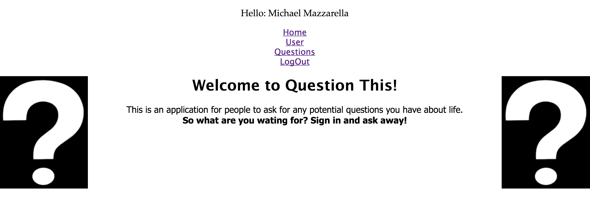

## Login Page

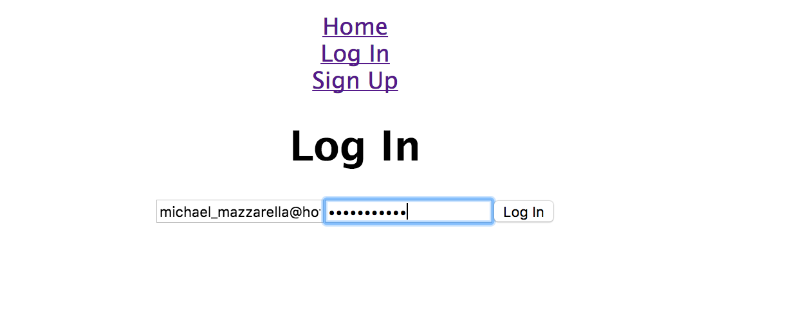

## Sign In Page

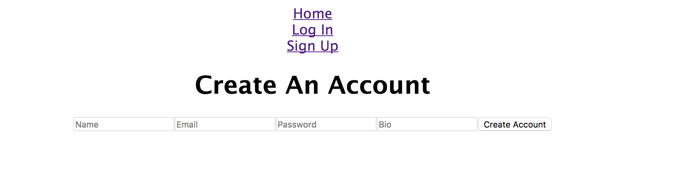

## User Page

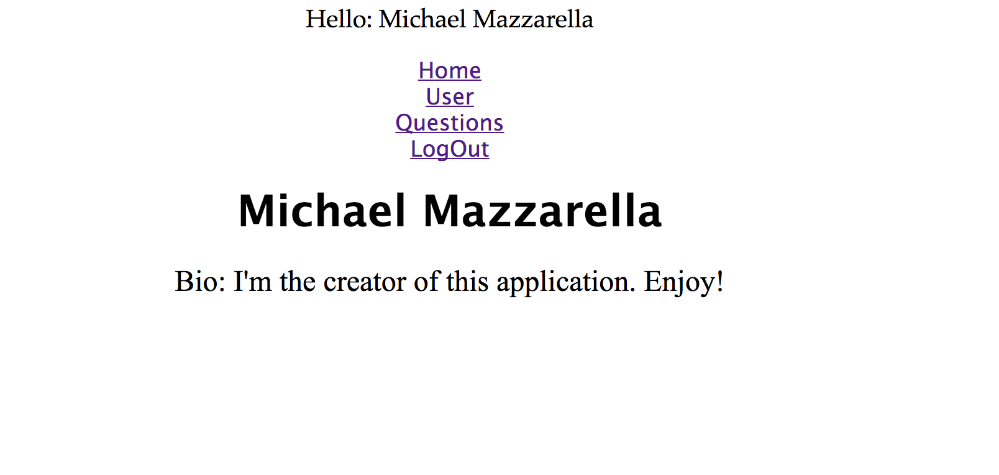

## Question Page

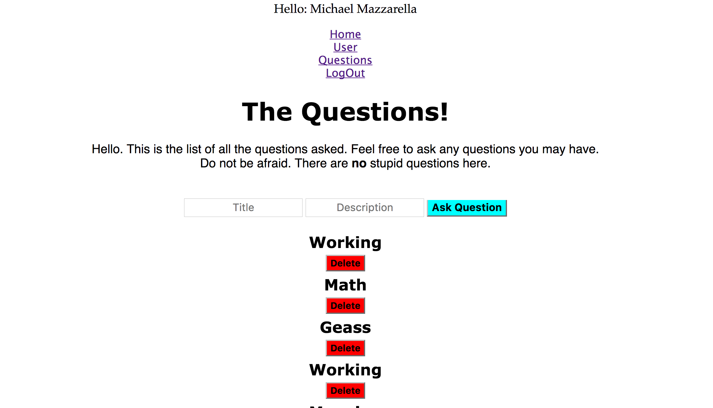

## Answer Section
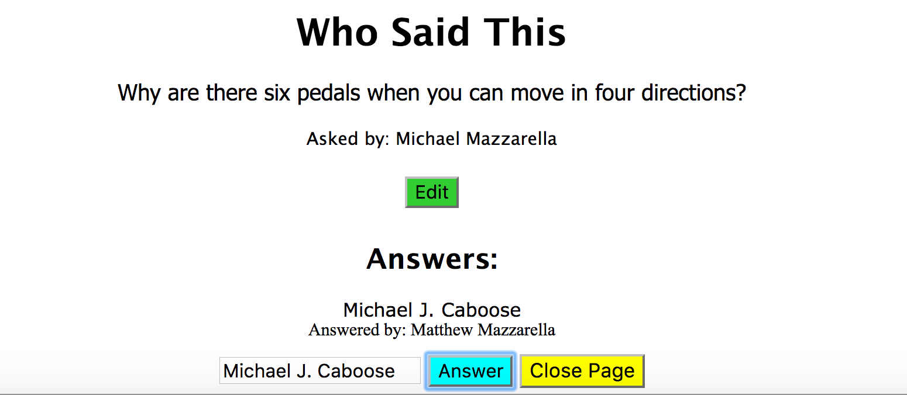

--

# WireFrames

## Welcome Page
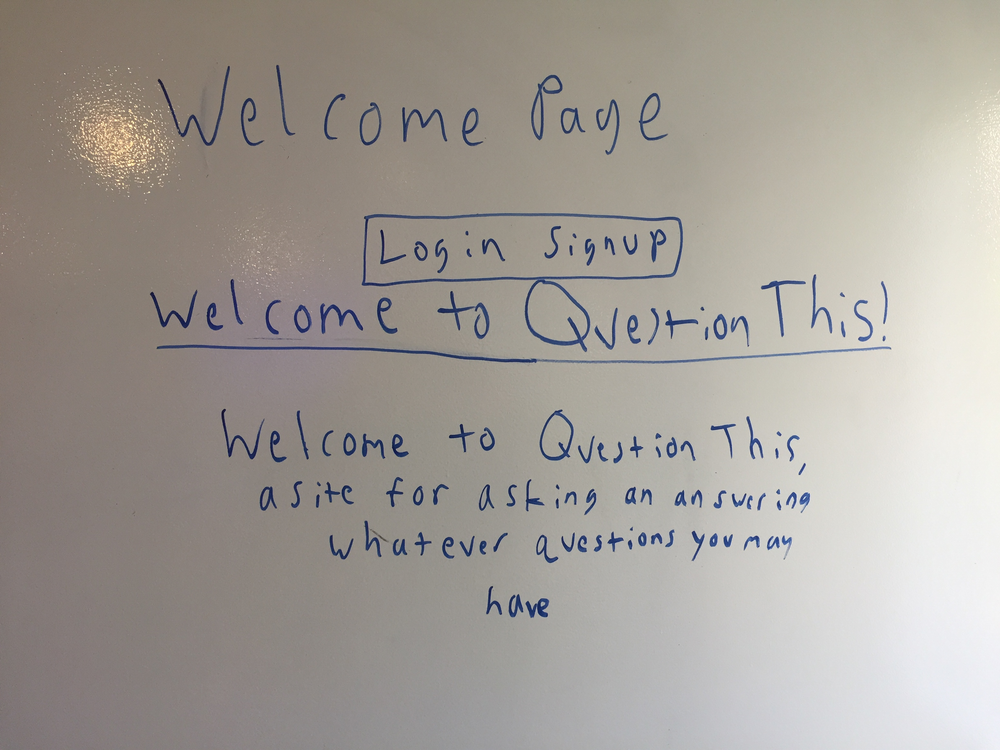

## Login
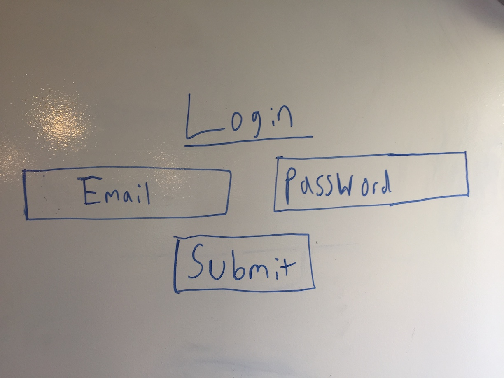

## SignUp
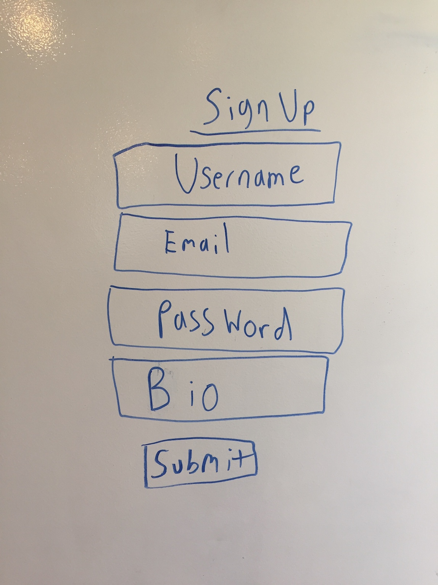

## User Page
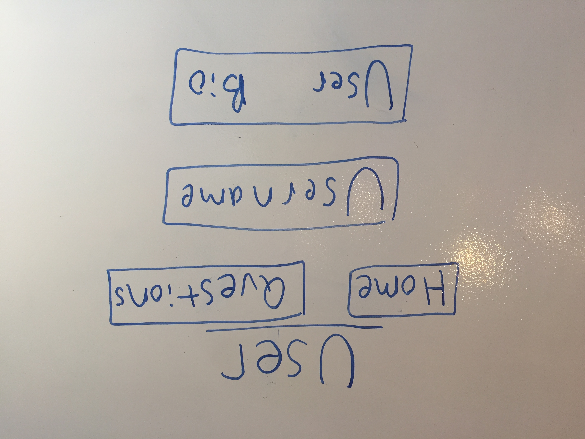

## Questions
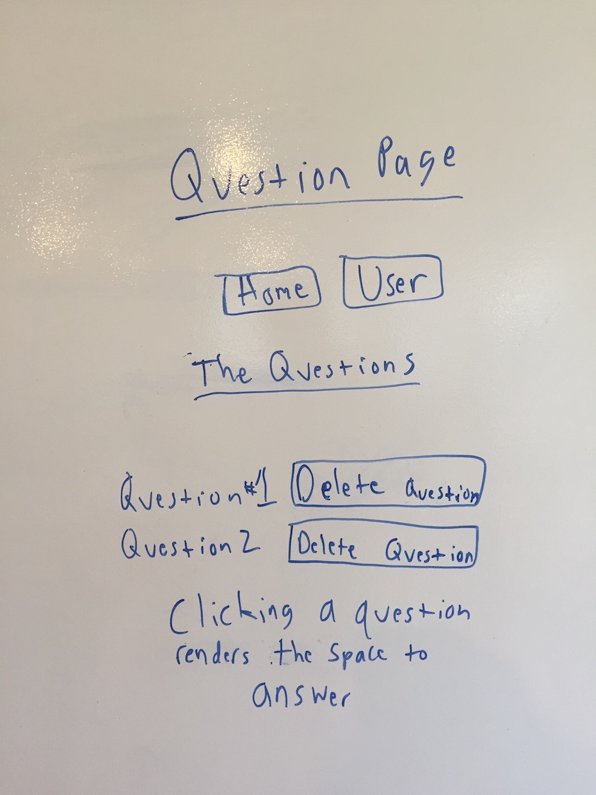

## Answer Section
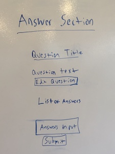

--
# Installation Instructions

To install this app you must run:

git clone on both client and server repos

npm install

mongod (on another window of the terminal)

nodemon

And then visit localhost 3000
