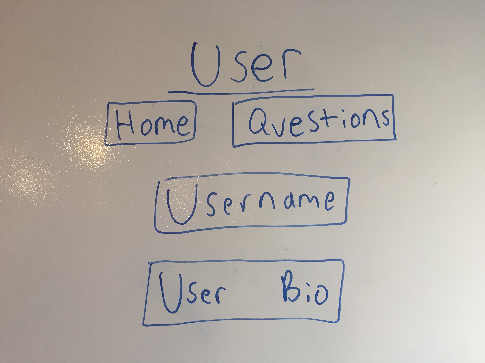

# QuestionThis

QuestionThis is the latest question and answer application. On this application, people are able to post questions, edit questions, delete questions, and most importantly, answer questions.
There is no judgment here: only users in the pursuit of knowledge.

Here is the link to our [app](https://still-dusk-48161.herokuapp.com/questions)

--

# Technologies Used

This app was made out of HTML, React.js, Express, and CSS.

--

# General Approach

My approach was to start with the user login and build out from there. I used a json web token for authentication as well. After that, I built up the Questions model, controller and routes. After that, I created a Questions page, that had a list of all the questions present. I also included the ability to delete questions with a button next to each queston. Then, I created a form that renders when a user clicks on a question. This form displays the details of the questions, the name of the user who asked the question, and a form for other users to post their own answers to the questions, which also appear in the form. Finally, I included a button in the form I had just created, which changes the field rendered to a space that allows the title and the text of the question to be edited and updated.

For a more detailed view of the work, here is my [Trello](https://trello.com/b/oqc04sL4/project-4) Board.

--
# Unsolved Problems
There are a number of additional features that I was unable to bring into the project as of yet.
Many of these features pertain to the user's page. While i can show some user information, I plan to show to have a list of questions the user have asked. I also plan to have the ability for user's to edit thier personal information.

--

# ScreenShots

## Opening Page

## Login Page

## Sign In Page

## User Page

## Question Page

## Answer Section

--

# WireFrames

## Welcome Page

## Login

## SignUp

## User Page

## Questions

## Answer Section

--
# Installation Instructions

To install this app you must run:

git clone on both client and server repos

npm install

mongod (on another window of the terminal)

nodemon

And then visit localhost 3000
